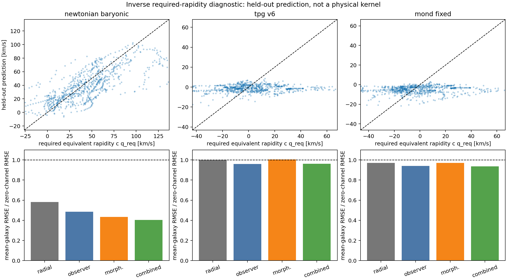

# Inverse Required-Rapidity Diagnostic v0.1

**Status:** DIAGNOSTIC_ONLY_NOT_ENDPOINT

## Question and identity

The observed endpoint is used deliberately to reconstruct the
terminal-equivalent rapidity required relative to each baseline:

$$
q_{\rm req}(R)=\operatorname{artanh}[v_{\rm obs}(R)/c]
-\operatorname{artanh}[v_{\rm base}(R)/c],
\qquad u_{\rm req}=c q_{\rm req}.
$$

This is an exact inverse identity for the declared rapidity shell. It
does not identify the physical source of the discrepancy.

## Frozen protocol

- Galaxies: 175; points: 3389.
- Training galaxies: 131; untouched holdout: 44.
- Baselines: Newtonian baryonic, frozen TPG/v6 and fixed MOND.
- Ridge strength: grouped cross-validation on training galaxies only.
- Every galaxy has equal total training weight.
- Endpoint values and residuals are forbidden predictors.
- Morphology families are available-data proxies, not promoted labels.
- Distance is geometric context, not a measured path-loss kernel.

## Holdout results

| baseline_id | model_id | holdout_mean_galaxy_rmse_model_kms | holdout_mean_galaxy_rmse_zero_kms | rmse_ratio_to_zero | mean_delta_rmse_model_minus_zero_kms | delta_rmse_bootstrap_ci_lower_kms | delta_rmse_bootstrap_ci_upper_kms | paired_sign_flip_p_lower | holdout_galaxy_win_fraction | holdout_point_pearson_r |
| --- | --- | --- | --- | --- | --- | --- | --- | --- | --- | --- |
| newtonian_baryonic | radial_only | 24.8724 | 42.6907 | 0.582618 | -17.8183 | -24.8109 | -10.2176 | 3.99992e-05 | 0.795455 | 0.435994 |
| newtonian_baryonic | distance_context | 21.2903 | 42.6907 | 0.498711 | -21.4004 | -28.1906 | -14.1472 | 1.99996e-05 | 0.840909 | 0.680939 |
| newtonian_baryonic | orientation_quality | 22.1359 | 42.6907 | 0.518518 | -20.5548 | -26.412 | -14.3905 | 1.99996e-05 | 0.818182 | 0.500445 |
| newtonian_baryonic | observer_geometry | 20.6959 | 42.6907 | 0.484788 | -21.9948 | -27.7556 | -16.078 | 1.99996e-05 | 0.818182 | 0.664873 |
| newtonian_baryonic | morphology_proxy | 18.5235 | 42.6907 | 0.433901 | -24.1672 | -30.4638 | -17.7004 | 1.99996e-05 | 0.863636 | 0.717938 |
| newtonian_baryonic | morphology_plus_distance | 18.4009 | 42.6907 | 0.431029 | -24.2898 | -30.6238 | -18.0547 | 1.99996e-05 | 0.863636 | 0.723981 |
| newtonian_baryonic | morphology_plus_orientation | 17.2143 | 42.6907 | 0.403234 | -25.4763 | -31.3126 | -19.4854 | 1.99996e-05 | 0.863636 | 0.74907 |
| newtonian_baryonic | combined | 17.2704 | 42.6907 | 0.404547 | -25.4203 | -31.2947 | -19.4656 | 1.99996e-05 | 0.863636 | 0.748102 |
| tpg_v6 | radial_only | 17.6546 | 17.6426 | 1.00068 | 0.0120129 | -0.10456 | 0.130769 | 0.576568 | 0.5 | 0.138539 |
| tpg_v6 | distance_context | 17.6443 | 17.6426 | 1.0001 | 0.00170413 | -0.100989 | 0.104092 | 0.51349 | 0.522727 | -0.0740523 |
| tpg_v6 | orientation_quality | 16.543 | 17.6426 | 0.937674 | -1.09959 | -2.50069 | 0.244757 | 0.0678586 | 0.568182 | 0.330905 |
| tpg_v6 | observer_geometry | 16.9329 | 17.6426 | 0.959775 | -0.709673 | -2.0797 | 0.542508 | 0.148397 | 0.613636 | 0.217626 |
| tpg_v6 | morphology_proxy | 17.7085 | 17.6426 | 1.00374 | 0.0659678 | -0.667086 | 0.799997 | 0.565149 | 0.5 | -0.0871091 |
| tpg_v6 | morphology_plus_distance | 17.6017 | 17.6426 | 0.997682 | -0.04089 | -0.362365 | 0.277072 | 0.402812 | 0.477273 | -0.113924 |
| tpg_v6 | morphology_plus_orientation | 16.88 | 17.6426 | 0.956779 | -0.762525 | -2.23172 | 0.579341 | 0.151877 | 0.590909 | 0.221431 |
| tpg_v6 | combined | 16.9825 | 17.6426 | 0.962586 | -0.660082 | -1.77388 | 0.334631 | 0.119118 | 0.545455 | 0.157243 |
| mond_fixed | radial_only | 17.5881 | 18.1138 | 0.970976 | -0.52574 | -1.54802 | 0.547766 | 0.168797 | 0.568182 | 0.107386 |
| mond_fixed | distance_context | 17.7207 | 18.1138 | 0.978299 | -0.393097 | -1.41291 | 0.625864 | 0.230295 | 0.590909 | -0.0382684 |
| mond_fixed | orientation_quality | 16.6702 | 18.1138 | 0.920303 | -1.44362 | -3.17867 | 0.187242 | 0.052219 | 0.613636 | 0.330955 |
| mond_fixed | observer_geometry | 17.0169 | 18.1138 | 0.939444 | -1.09689 | -2.80689 | 0.551687 | 0.105838 | 0.568182 | 0.184297 |
| mond_fixed | morphology_proxy | 17.5681 | 18.1138 | 0.969872 | -0.545732 | -1.64893 | 0.560083 | 0.173537 | 0.568182 | 0.00356917 |
| mond_fixed | morphology_plus_distance | 17.6076 | 18.1138 | 0.972052 | -0.506239 | -1.61784 | 0.57119 | 0.188296 | 0.590909 | -0.030134 |
| mond_fixed | morphology_plus_orientation | 16.7852 | 18.1138 | 0.926651 | -1.32863 | -3.11829 | 0.432737 | 0.0792584 | 0.568182 | 0.228615 |
| mond_fixed | combined | 16.9483 | 18.1138 | 0.935656 | -1.16552 | -2.72321 | 0.348577 | 0.0754785 | 0.636364 | 0.168925 |

A ratio below one improves on the zero-additional-rapidity control.
Randomization and bootstrap intervals use the 44 holdout galaxies.

## Observer geometry added to morphology

| baseline_id | comparison_id | left_model | right_model | mean_delta_rmse_left_minus_right_kms | bootstrap_ci_lower_kms | bootstrap_ci_upper_kms | paired_sign_flip_p_lower | left_beats_right_galaxy_fraction |
| --- | --- | --- | --- | --- | --- | --- | --- | --- |
| newtonian_baryonic | distance_added_to_morphology | morphology_plus_distance | morphology_proxy | -0.122608 | -0.310244 | 0.0655642 | 0.109738 | 0.636364 |
| newtonian_baryonic | orientation_added_to_morphology | morphology_plus_orientation | morphology_proxy | -1.30919 | -2.50588 | -0.0720539 | 0.0204596 | 0.659091 |
| newtonian_baryonic | observer_added_to_morphology | combined | morphology_proxy | -1.25313 | -2.52378 | -0.028112 | 0.0270795 | 0.659091 |
| newtonian_baryonic | distance_added_after_orientation_and_morphology | combined | morphology_plus_orientation | 0.0560533 | -0.0299184 | 0.145728 | 0.888202 | 0.431818 |
| tpg_v6 | distance_added_to_morphology | morphology_plus_distance | morphology_proxy | -0.106858 | -0.55476 | 0.344453 | 0.322874 | 0.545455 |
| tpg_v6 | orientation_added_to_morphology | morphology_plus_orientation | morphology_proxy | -0.828493 | -1.91125 | 0.279331 | 0.0751585 | 0.636364 |
| tpg_v6 | observer_added_to_morphology | combined | morphology_proxy | -0.726049 | -1.44051 | -0.0103438 | 0.0287194 | 0.636364 |
| tpg_v6 | distance_added_after_orientation_and_morphology | combined | morphology_plus_orientation | 0.102443 | -0.414956 | 0.61802 | 0.643187 | 0.409091 |
| mond_fixed | distance_added_to_morphology | morphology_plus_distance | morphology_proxy | 0.0394934 | -0.00625318 | 0.0838779 | 0.951841 | 0.295455 |
| mond_fixed | orientation_added_to_morphology | morphology_plus_orientation | morphology_proxy | -0.782896 | -2.07524 | 0.48208 | 0.125037 | 0.568182 |
| mond_fixed | observer_added_to_morphology | combined | morphology_proxy | -0.619788 | -1.51444 | 0.181419 | 0.0833983 | 0.522727 |
| mond_fixed | distance_added_after_orientation_and_morphology | combined | morphology_plus_orientation | 0.163108 | -0.378749 | 0.709474 | 0.718386 | 0.386364 |

## Interpretation

The Newton-relative inverse target is substantially predictable, but
ordinary baryonic scaling and the established mass-discrepancy relation
are the stronger explanation. After TPG/v6 or MOND, the combined model
shows only small holdout improvement and weak pointwise correlation.
Observer-geometry proxies do not add a robust component beyond morphology.

The informative result is therefore mostly negative: the current broad
source and distance descriptors do not recover a stable universal
post-TPG/MOND rapidity profile on unseen galaxies.

## Claim boundary

This result cannot separate body morphology, observer access, calibration,
beam/deprojection systematics or baseline misspecification. It derives no
physical Tau kernel, permits no endpoint promotion and supplies no
dark-matter replacement law.

