# P0 SkyView Preview Images

This report records PNG previews rendered from SkyView image data for the
P0 morphology-inspection targets. The previews are source material for a
future residual-blind human review only. They are not morphology labels,
not image classifications, and not endpoint scores.

## Preview Summary

| survey | n_requests | n_rendered | median_width_px | median_height_px |
| --- | --- | --- | --- | --- |
| 2MASS-K | 4 | 4 | 300.0 | 300.0 |
| DSS2 Red | 4 | 4 | 300.0 | 300.0 |
| WISE 3.4 | 4 | 4 | 300.0 | 300.0 |

## Preview Manifest

| galaxy | survey | preview_png_path | preview_status | preview_width_px | preview_height_px |
| --- | --- | --- | --- | --- | --- |
| NGC0100 | 2MASS-K | reports/p0_skyview_previews/NGC0100_2MASS_K.png | PREVIEW_RENDERED | 300 | 300 |
| NGC0100 | DSS2 Red | reports/p0_skyview_previews/NGC0100_DSS2_Red.png | PREVIEW_RENDERED | 300 | 300 |
| NGC0100 | WISE 3.4 | reports/p0_skyview_previews/NGC0100_WISE_3_4.png | PREVIEW_RENDERED | 300 | 300 |
| NGC0247 | 2MASS-K | reports/p0_skyview_previews/NGC0247_2MASS_K.png | PREVIEW_RENDERED | 300 | 300 |
| NGC0247 | DSS2 Red | reports/p0_skyview_previews/NGC0247_DSS2_Red.png | PREVIEW_RENDERED | 300 | 300 |
| NGC0247 | WISE 3.4 | reports/p0_skyview_previews/NGC0247_WISE_3_4.png | PREVIEW_RENDERED | 300 | 300 |
| NGC0300 | 2MASS-K | reports/p0_skyview_previews/NGC0300_2MASS_K.png | PREVIEW_RENDERED | 300 | 300 |
| NGC0300 | DSS2 Red | reports/p0_skyview_previews/NGC0300_DSS2_Red.png | PREVIEW_RENDERED | 300 | 300 |
| NGC0300 | WISE 3.4 | reports/p0_skyview_previews/NGC0300_WISE_3_4.png | PREVIEW_RENDERED | 300 | 300 |
| NGC6503 | 2MASS-K | reports/p0_skyview_previews/NGC6503_2MASS_K.png | PREVIEW_RENDERED | 300 | 300 |
| NGC6503 | DSS2 Red | reports/p0_skyview_previews/NGC6503_DSS2_Red.png | PREVIEW_RENDERED | 300 | 300 |
| NGC6503 | WISE 3.4 | reports/p0_skyview_previews/NGC6503_WISE_3_4.png | PREVIEW_RENDERED | 300 | 300 |

## Preview Gallery

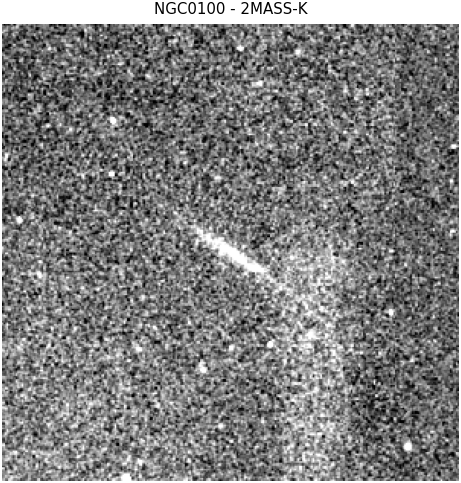

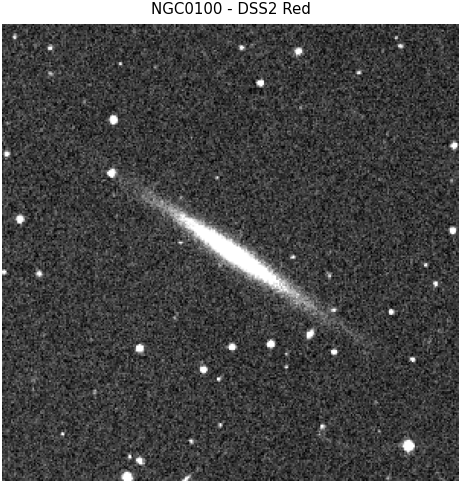

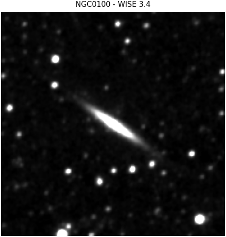

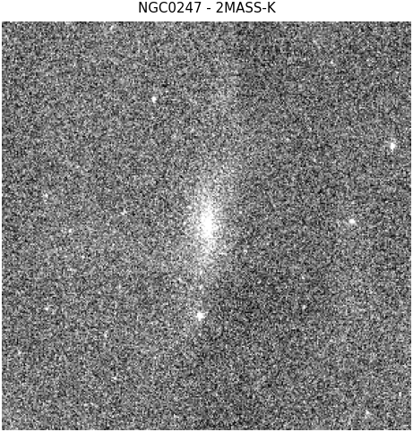

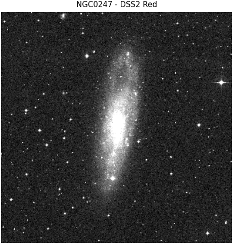

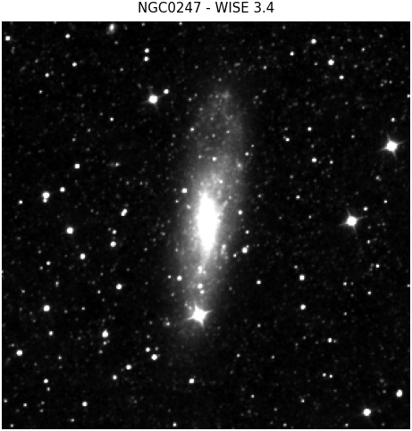

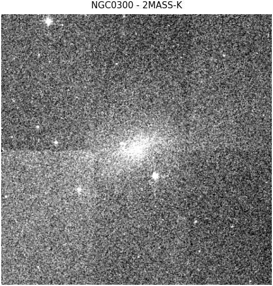

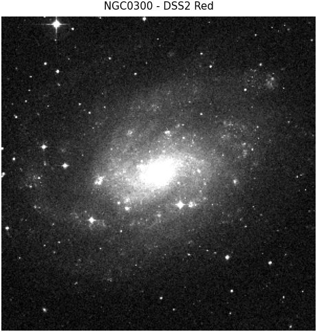

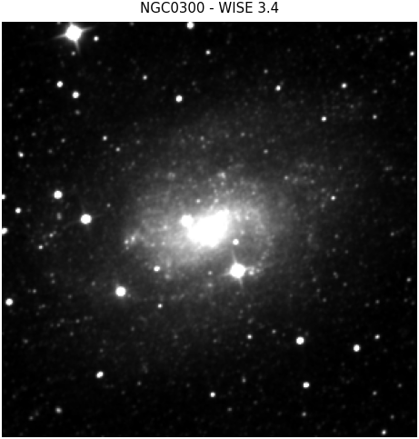

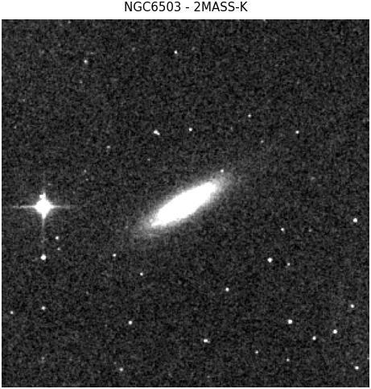

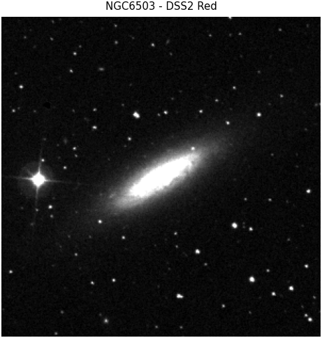

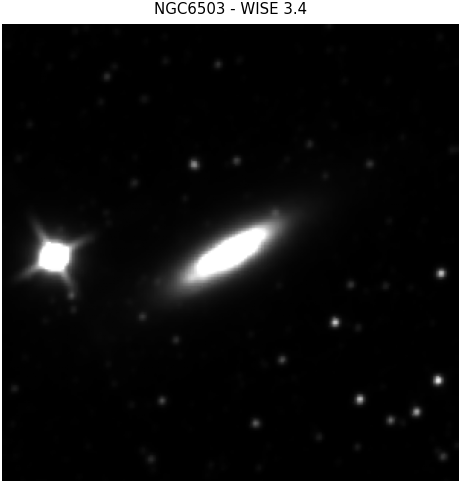

## Claim Boundary

No image classification is performed. No accepted morphology label is
emitted. No endpoint score is computed.

Claim boundary: `p0_skyview_previews_not_image_classification_not_endpoint`.
